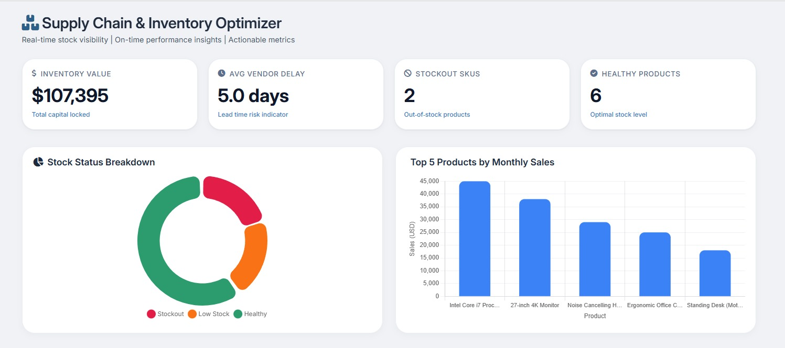
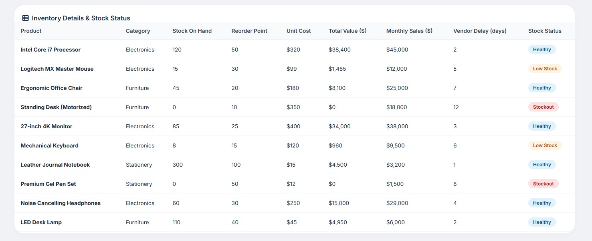

# 📦 Smart Supply Chain & Inventory Optimization Dashboard

A modern and interactive Supply Chain & Inventory Optimization Dashboard built using **HTML, CSS, and JavaScript**. This project provides real-time inventory visibility, stock monitoring, vendor performance tracking, and actionable business insights through an intuitive dashboard interface.

## 📸 Dashboard Preview

### Main Dashboard


### Analytics & Insights


## 🚀 Features

* 📊 Real-Time Inventory Monitoring
* 📦 Stock Availability Tracking
* ⚠️ Low Stock & Stockout Alerts
* 🚚 Vendor Delay Analysis
* 💰 Inventory Value Tracking
* 📈 Monthly Sales Performance Analysis
* 🎯 Interactive Charts & Visualizations
* 📱 Responsive Dashboard Design
* 🔍 Actionable Supply Chain Insights

## 🛠️ Technologies Used

* HTML5
* CSS3
* JavaScript
* Chart.js

## 📸 Dashboard Preview

### Main Dashboard


> Replace the image path with your actual dashboard screenshot.

## 📂 Project Structure

```text
Smart-Supply-Chain-Inventory-Optimization-Dashboard/
│
├── index.html
├── style.css
├── script.js
├── assets/
│   └── dashboard-preview.png
│
└── README.md
```

## 📈 Key Metrics Displayed

* Total Inventory Value
* Average Vendor Delay
* Healthy Products Count
* Stockout Products Count
* Product-wise Monthly Sales
* Stock Status Distribution

## 🎯 Business Benefits

* Improve inventory management efficiency
* Reduce stock shortages and overstock situations
* Monitor supplier performance
* Support data-driven decision making
* Enhance supply chain visibility

## 💡 Future Enhancements

* Power BI Integration
* Real-Time Database Connectivity
* Predictive Inventory Forecasting
* AI-Based Demand Forecasting
* Automated Reorder Recommendations
* Export Reports (PDF/Excel)

## 🔗 GitHub Repository

https://github.com/Har2003sha/Smart-Supply-Chain-Inventory-Optimization-Dashboard

## 👩‍💻 Author

**Harshita Sharma**

Final Year Artificial Intelligence & Data Science Student

* Data Analytics
* Data Science
* Business Intelligence
* Machine Learning
* Frontend Development

## ⭐ Support

If you found this project useful, please consider giving it a ⭐ on GitHub.

---

Made with ❤️ using HTML, CSS, and JavaScript
